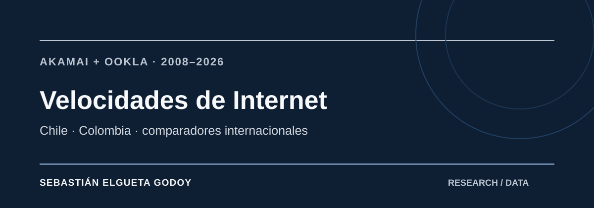

# Velocidades de Internet — Chile, Colombia y comparadores internacionales



[](https://github.com/selguetagodoy/Ookla/actions/workflows/data-package.yml)

**Latest release:** [v0.1.0](https://github.com/selguetagodoy/Ookla/releases/tag/v0.1.0) · [Concept DOI: 10.5281/zenodo.22921202](https://doi.org/10.5281/zenodo.22921202) · [Version DOI: 10.5281/zenodo.22921203](https://doi.org/10.5281/zenodo.22921203)

**Fecha del snapshot citable:** 2026-09-23

[](https://doi.org/10.5281/zenodo.22921202)
[](https://github.com/selguetagodoy/Ookla/actions/workflows/source-urls.yml)

**Public dataset landing page:** https://selguetagodoy.github.io/dataset-velocidades-internet.html

**Thematic analysis:** [Telecomunicaciones en Chile: conectividad y regulación](https://selguetagodoy.github.io/telecomunicaciones.html)

Repositorio de análisis reproducible sobre la evolución de las velocidades de Internet fija y móvil, con foco en Colombia y Chile y comparación con Nueva Zelanda, el promedio OCDE y el promedio mundial.

## Alcance

La serie reúne información histórica de Akamai y Ookla entre 2008 y 2026. Las familias metodológicas se mantienen separadas y no se interpretan como una única serie homogénea.

- **Akamai** aporta observaciones históricas de conectividad entre 2008 y 2017.
- **Ookla** aporta observaciones de Speedtest y datos abiertos desde 2019. El dato 2018 disponible corresponde a una cobertura parcial del índice y se conserva con esa advertencia.
- **2026 es provisional** y corresponde a los trimestres disponibles al momento del corte.
- Los valores ausentes se mantienen como `NA`. No se interpolan.

## Comparadores principales

- Colombia
- Chile
- Nueva Zelanda
- Promedio OCDE
- Promedio mundial

## Estructura

```text
.
├── README.md
├── data/
│   └── comparacion_anual_2008_2026.csv
├── docs/
│   ├── metodologia.md
│   └── fuentes.md
└── scripts/
    ├── requirements.txt
    └── analizar_comparacion.py
```

## Lectura rápida

En 2026, la velocidad fija disponible en la base alcanza **399,46 Mbps en Chile**, **237,86 Mbps en Colombia**, **235,26 Mbps en Nueva Zelanda**, **271,23 Mbps en el promedio OCDE** y **153,16 Mbps en el promedio mundial**.

En móvil, Nueva Zelanda y el promedio OCDE presentan los valores más altos dentro de este conjunto comparado. Colombia registra **82,09 Mbps** y Chile **99,90 Mbps** en el corte provisional 2026.

Estas cifras no deben utilizarse para calcular una tasa de crecimiento continua entre Akamai y Ookla. El cambio de fuente implica un quiebre metodológico explícito.

## Reproducción

```bash
pip install -r scripts/requirements.txt
python scripts/analizar_comparacion.py
```

El script lee la base anual y genera una tabla resumen con los últimos valores disponibles por entidad.

## Fuente y trazabilidad

La documentación de fuentes y las principales decisiones metodológicas están en `docs/`. Ookla publica sus datos abiertos de performance en tiles trimestrales y señala que la cobertura parte en Q1 2019.

Este repositorio es un proyecto independiente de análisis. **No está afiliado ni respaldado por Ookla ni Akamai.** Los nombres y marcas pertenecen a sus respectivos titulares.

## Trazabilidad y control de fuentes

La jerarquía de evidencia está definida en [SOURCE_OF_TRUTH.md](SOURCE_OF_TRUTH.md) y el ledger canónico en [sources.csv](sources.csv). Allí se separan Ookla Open Data, Speedtest Global Index y los informes históricos de Akamai, evitando tratarlos como una sola fuente o una serie metodológicamente continua.

GitHub Actions revisa semanalmente la disponibilidad de las URLs registradas. Un bloqueo 4xx se reporta como advertencia; un error persistente de red o servidor obliga a revisar la fuente antes de una nueva versión.

## Autor

**[Sebastián Elgueta Godoy](https://selguetagodoy.github.io/)**  
Sociólogo. Análisis de datos, políticas públicas, telecomunicaciones, conectividad e infraestructura digital.

Perfiles: [GitHub](https://github.com/selguetagodoy) · [LinkedIn](https://cl.linkedin.com/in/sebastian-elgueta-godoy) · [Substack](https://substack.com/@sebastianelguetagodoy) · [Coordenadas Públicas](https://www.coordenadaspublicas.cl/nosotros/)


## Citation and metadata

- [CITATION.md](CITATION.md) — copy-ready human citation guide
- [CITATION.cff](CITATION.cff) — GitHub/academic citation metadata
- [CITATION.bib](CITATION.bib) — BibTeX citation
- [codemeta.json](codemeta.json) — machine-readable research metadata
- [ro-crate-metadata.json](ro-crate-metadata.json) — RO-Crate 1.2 research object metadata
- [datapackage.json](datapackage.json) — machine-readable public data resources
- [PUBLIC_RESOURCES.md](PUBLIC_RESOURCES.md) — human-readable index of declared public resources
- [NOTICE.md](NOTICE.md) — authorship and third-party reuse boundaries
- [CHANGELOG.md](CHANGELOG.md) — version history and documented changes
- [CONTRIBUTING.md](CONTRIBUTING.md) — evidence requirements for corrections and updates
- [RELEASE_POLICY.md](RELEASE_POLICY.md) — versioning and Zenodo archival policy

## Investigación relacionada

- [Chile Digital Inclusion](https://selguetagodoy.github.io/dataset-chile-digital-inclusion.html) — conectividad e inclusión digital con cobertura comunal.
- [Atlas de la Desconexión Digital de Chile](https://selguetagodoy.github.io/atlas-desconexion-digital-chile.html) — lectura territorial de la brecha digital.
- [Latin America Digital Infrastructure](https://selguetagodoy.github.io/dataset-latin-america-digital-infrastructure.html) — conectividad e infraestructura digital comparada en América Latina.

